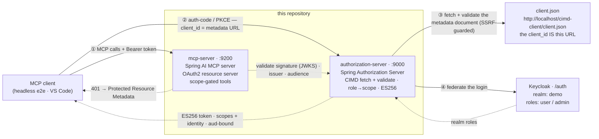
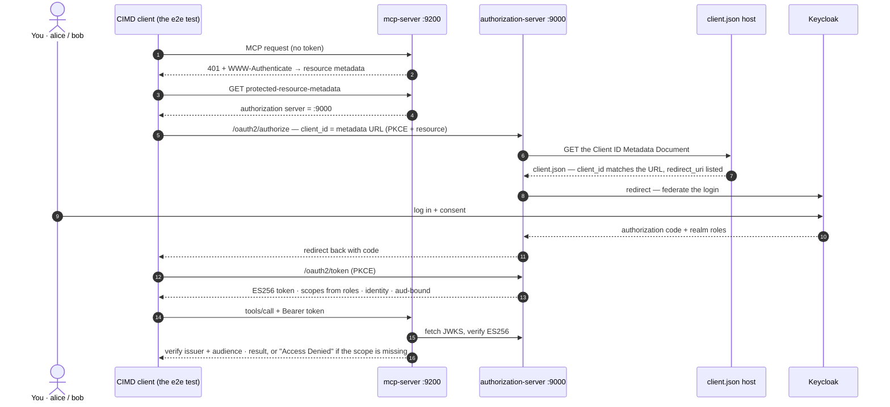

<p align="center">
  
  
  
  
  
</p>

<h1 align="center">Spring OAuth2 MCP · CIMD</h1>

<p align="center">
  An OAuth2-secured <a href="https://modelcontextprotocol.io">Model Context Protocol</a> server, with a
  Spring Authorization Server that accepts <strong>Client ID Metadata Documents</strong> (CIMD) instead of
  Dynamic Client Registration, in front of a federated identity provider.<br>
  No registration step: the client's <code>client_id</code> <em>is a URL</em>, and the server fetches and
  validates the metadata document behind it.
</p>

<p align="center">
  Companion repo: <a href="https://github.com/lukas-grigis/spring-oauth2-mcp"><code>spring-oauth2-mcp</code></a> — the DCR-proxy reference this rebuild replaces.
</p>

---

## What this shows

The MCP authorization spec was revised on **2025-11-25**, and it changed how an MCP client obtains an
OAuth client identity. **Client ID Metadata Documents became the preferred mechanism** — *"Authorization
servers and MCP clients **SHOULD** support OAuth Client ID Metadata Documents"* — while **Dynamic Client
Registration (RFC 7591) was demoted to MAY**, kept for backwards compatibility with earlier revisions.

Under CIMD nothing is registered and nothing is stored. The client names a URL as its `client_id`; the
authorization server *fetches* that URL, reads the client's metadata (name, redirect URIs, auth method),
validates it, and treats the result as the registered client. This repo is that SHOULD path, working end
to end:

- a **Spring Authorization Server** that resolves clients from their metadata URL: it detects
  URL-formatted `client_id`s, fetches the document through an **SSRF-guarded** HTTP client, validates it
  (the document's `client_id` must equal the URL exactly, the request's `redirect_uri` must be listed,
  public PKCE client only), and caches it briefly. Its metadata advertises
  `client_id_metadata_document_supported: true` and **no `registration_endpoint`**;
- **federated human login** upstream (Keycloak here) — the IdP only authenticates the user, and needs to
  know nothing about CIMD;
- upstream **realm roles** mapped to fine-grained **scopes**, the user's identity propagated, and **ES256**
  tokens minted — audience-bound to the resource the client asked for (RFC 8707);
- an MCP server that stays a clean resource server: it advertises its **Protected Resource Metadata**
  (RFC 9728), validates the tokens (signature, issuer, audience), and gates its tools by scope.

## Architecture



Client identity works the opposite way from registration: nothing exists server-side until the flow
starts. The authorization server dereferences the `client_id` URL at authorization time, refuses the
document unless its `client_id` equals that URL exactly and the request's redirect URI is listed in it,
and only then lets the auth-code flow proceed. From there the demo is the same story as the companion
repo: the upstream `roles` claim expands to scopes (`user` → `note:read`, `note:write`; `admin` → also
`note:admin`), the scopes land on the access token, and the MCP server turns them into `SCOPE_*`
authorities enforced with `@PreAuthorize` on each tool. Federated identity in, fine-grained
authorization out.

## The connection flow



## Quick start

You need [Docker](https://docs.docker.com/get-docker/) and [mise](https://mise.jdx.dev/). mise provisions
Java, Maven and Node automatically, so there's nothing else to install.

> The demo binds host ports **80** (Traefik: Keycloak at `/auth` **and** the client metadata document at
> `/cimd-client/`), **5432** (Postgres) and **9000** / **9200** (the two services). If port 80 is taken,
> set `WEB_PORT` in `support/.env` — and update the `client_id` inside `support/cimd-client/client.json`
> to match, because that URL *is* the client's identity.

```bash
git clone https://github.com/lukas-grigis/spring-oauth2-mcp-cimd.git
cd spring-oauth2-mcp-cimd
mise run demo
```

`mise run demo` builds both modules, starts the infrastructure (Traefik + Postgres + Keycloak + the
static host serving `client.json` — the first run pulls the images, so give it a minute), provisions the
`demo` realm, starts both services, runs the discovery checks, and then **performs the allowed/denied
tool calls for alice and bob live** so you can watch the CIMD flow and the scope gating work. `Ctrl+C`
stops everything.

| Service                  | URL                                            |
|---------------------------|------------------------------------------------|
| Authorization server     | http://localhost:9000                          |
| MCP server               | http://localhost:9200/mcp  *(Streamable HTTP)* |
| Client metadata document | http://localhost/cimd-client/client.json       |
| Keycloak                 | http://localhost/auth  *(admin / admin)*       |

## Try the flow yourself

Against a running stack:

```bash
mise run check      # CIMD advertised + NO registration_endpoint; ES256 JWKS; /mcp 401 → Protected Resource Metadata
curl http://localhost/cimd-client/client.json   # the demo client's identity — this URL IS its client_id
mise run test:e2e   # the full flow, headless: URL client_id → fetch + validate → Keycloak login → the allow/deny matrix
```

> Wiring a client by hand? Send the RFC 8707 `resource` indicator as the exact canonical resource the
> server advertises in its Protected Resource Metadata — `http://localhost:9200/mcp`. Audience validation
> is an exact match, so a near-miss (trailing slash, bare origin, `127.0.0.1` vs `localhost`) is rejected.

### What about the MCP Inspector?

At the time of writing, the MCP Inspector still obtains its client identity via Dynamic Client
Registration: it POSTs to a registration endpoint instead of presenting a URL `client_id`. This server
exposes no registration endpoint, so the Inspector can discover it but cannot complete the OAuth flow
(`mise run inspector` prints the same honest status). Want a live interactive CIMD client? **VS Code** is
one — it identifies itself with the metadata URL `https://vscode.dev/oauth/client-metadata.json`. Add
`http://localhost:9200/mcp` as an MCP server in VS Code and the authorization server resolves VS Code's
document over HTTPS exactly the way it resolves the demo client's, then sends you through the same
Keycloak login.

### What about Claude Code?

Claude Code does speak CIMD — it publishes an identity document at
`https://claude.ai/oauth/claude-code-client-metadata` and presents that URL as its `client_id`. This
server accepts that identity: it fetches the document, validates it, and lets Claude Code in. The flow
then fails one step later, on the redirect URI, and the reason is worth understanding because it is the
whole CIMD trust model doing its job.

Claude Code's published document declares **portless** loopback callbacks (`http://localhost/callback`,
`http://127.0.0.1/callback`), but at runtime it listens on a random high port and sends
`http://localhost:<port>/callback`. That is not in its own document, so the authorization server refuses
it with a `400`. RFC 8252 §7.3 does require servers to allow *any* port for loopback redirects — but for
the IP literals `127.0.0.1` / `[::1]`, not for the name `localhost`, which a hosts file or DNS can
redirect away from the machine. Spring Authorization Server implements exactly that distinction, so
`http://127.0.0.1:<port>/callback` would be accepted and `http://localhost:<port>/callback` is not.
*(Observed with Claude Code 2.1.219, 2026-07; the callback template can change in any release.)*

Claude Code can be pointed at a different identity document and a fixed port, which is all it takes to
make its runtime behaviour and its published identity agree. This repo ships such a document
([`support/cimd-client/claude-code.json`](support/cimd-client/claude-code.json), served alongside the
demo client's) plus an [`.mcp.json`](.mcp.json) declaring the MCP server, so with the stack running:

```bash
MCP_OAUTH_CLIENT_METADATA_URL=http://localhost/cimd-client/claude-code.json \
MCP_OAUTH_CALLBACK_PORT=3118 \
claude
```

Then `/mcp` to authenticate, and log in as `alice` / `alice`. Note what did *not* happen: nothing was
registered, and this server stored no client. Claude Code brought a URL, the server dereferenced it, and
the redirect URI was honoured only because the document said so.

## Test users

| User  | Password | Realm role | Scopes minted                           | Can call                              |
|-------|----------|------------|-----------------------------------------|----------------------------------------|
| alice | alice    | `user`     | `note:read`, `note:write`               | `whoami`, `list_notes`, `create_note` |
| bob   | bob      | `admin`    | `note:read`, `note:write`, `note:admin` | the above **+** `purge_notes`         |

`whoami` is open to any authenticated caller; `list_notes` needs `note:read`, `create_note` needs
`note:write`, and `purge_notes` needs `note:admin`. A token without the scope gets a tool error — that
allow/deny matrix is the demo.

## Demo shortcuts

The CIMD draft requires `https` client IDs; a fully local demo can't do TLS without ceremony. These are
the deliberate shortcuts, each marked `DEMO ONLY` where it lives in the code:

- **Plain-HTTP client IDs, loopback only** — the demo document is served at
  `http://localhost/cimd-client/client.json`, so the authorization server enables the mcp-security
  library's loopback exception (`OAuth2StoreConfiguration`): `localhost` / `127.0.0.1` / `[::1]` may use
  plain HTTP for the `client_id` URL and the document's redirect URIs. Any non-loopback URL still
  requires HTTPS.
- **The SSRF guard relaxes loopback in the `demo` profile** — the metadata fetcher blocks private,
  link-local and loopback ranges via a single `InetAddressFilter` bean (`SsrfGuardConfiguration`); the
  default `demo` profile allows loopback back in so the locally served document is fetchable. Activate
  any other profile (e.g. `SPRING_PROFILES_ACTIVE=prod`) and the strict guard is back.
- **Document caching is the library default** — nginx sends no `Cache-Control` on `client.json`, so the
  authorization server caches a fetched document for the library's default 5 minutes. Edit
  `client.json` and the change can take that long to be noticed.

## Not covered

Kept out on purpose, so the CIMD path stays small enough to read in one sitting:

- **Trust policies** — every syntactically valid document from an allowed address is accepted; deciding
  *which* client URLs to trust (allowlists, domain pinning, reputation) is your policy layer, not this demo's.
- **`private_key_jwt` client authentication** — the demo client is public
  (`token_endpoint_auth_method: "none"` + PKCE); CIMD's confidential-client story is not wired.
- **Metadata-policy edge cases** — scope narrowing and the draft's more exotic validation corners.
- **CIMD auto-configuration** — the wiring here is explicit beans; Boot-style autoconfig is upstream
  mcp-security's job, tracked in [spring-ai-community/mcp-security#24](https://github.com/spring-ai-community/mcp-security/issues/24).
- **Dynamic Client Registration** — this server exposes none; the DCR-proxy pattern lives in the
  companion repo, [`spring-oauth2-mcp`](https://github.com/lukas-grigis/spring-oauth2-mcp).

## Project structure

```
.
├── authorization-server/   # OAuth2 AS (:9000): CIMD fetch + validate, federation, ES256, role→scope mapping
├── mcp-server/             # Spring AI MCP server (:9200): resource server + scope-gated tools
├── support/                # docker-compose (Traefik + Postgres + Keycloak + the client.json host) + the Keycloak enroller
├── test/                   # headless end-to-end test (TypeScript / tsx) — the demo CIMD client
└── mise.toml               # tasks: build · test · infra · demo · check · test:e2e · inspector
```

## Tech stack

| Layer                | What's running                                                                                                                |
|-----------------------|---------------------------------------------------------------------------------------------------------------------------------|
| Authorization server | Spring Authorization Server + [spring-ai-community/mcp-security] (CIMD client resolution, ES256, role→scope, RFC 8707 `aud`)  |
| MCP server           | Spring AI 2.0 MCP server (Streamable HTTP, WebMVC) + mcp-server-security (resource server · RFC 9728 PRM, audience-validated) |
| Identity provider    | Keycloak 26.6 (realm `demo`, federated via OAuth2 auth-code)                                                                  |
| Build / runtime      | Spring Boot 4.1, Java 25, Maven (multi-module)                                                                                |
| Infra                | Traefik + Postgres + nginx (serves `client.json`) via Docker Compose; mise for tasks + toolchain                              |

[spring-ai-community/mcp-security]: https://github.com/spring-ai-community/mcp-security

## Running tests

```bash
mise run test       # offline JUnit: the role→scope contract, the @PreAuthorize scope gates, and the SSRF guard refusing private-range URLs
mise run test:e2e   # live end-to-end: CIMD (URL client_id), federated login + consent, the allow/deny matrix (stack must be up)
```

## Security notice

This is a demo, optimized for clarity, not production:

- the ES256 signing key and the upstream client secret are committed in plain text (use a real key /
  secrets manager);
- Keycloak runs in `start-dev` with SSL disabled and the master realm's `sslRequired` relaxed over HTTP;
- the Keycloak client uses `fullScopeAllowed` (every realm role flows into the token) — scope it down in production;
- **client identity is an open club** — that is the CIMD model: anyone whose metadata URL passes
  validation can start an authorization flow, and the flow stays safe through PKCE, exact redirect-URI
  matching against the fetched document, and the SSRF guard on the fetcher. Nothing accumulates in the
  database (documents are resolved, not registered), but a production deployment should add a trust
  policy for which client URLs it accepts (see "Not covered");
- the plain-HTTP + loopback relaxations described under "Demo shortcuts" are for the local stack only;
- CORS is opened for a browser client origin, and the authorization server's CSP is demo-tight but unaudited;
- test user passwords are trivial.

What it *does* get right and you can lean on: tokens are **ES256**, scopes come from the upstream
**roles** (never from what the client asks for), the human's identity is propagated onto the token, the
resource server **validates the `aud`** (RFC 8707) so a token minted for another resource is rejected,
and the CIMD fetch runs through an **address-filtered HTTP client** so a hostile `client_id` cannot steer
the server at internal endpoints. Still — don't deploy this as-is; use it as a reference for the moving
parts.

> The `org.springaicommunity` MCP security artifacts are pre-1.0 (`0.1.13`); this repo runs them on
> Spring Boot 4.1.0 / Spring Security 7.1.0 / Spring AI 2.0.0 / MCP SDK 2.0.0. Bump them together.

## Standards and sources

The OAuth2, OIDC, and MCP specs this project implements are documented in
[`docs/STANDARDS.md`](docs/STANDARDS.md): plain-English explanations, how each maps to the code, and
a link to every primary source (the RFCs, the CIMD draft, and the MCP 2025-11-25 authorization
spec).

## Contributing

Found a bug or have an idea? Open an issue or a pull request.

1. Fork the repo
2. Create a branch (`git checkout -b my-change`)
3. Make your changes
4. Run `mise run test` (and `mise run test:e2e` against a running stack)
5. Open a PR

## License

[MIT](LICENSE)
